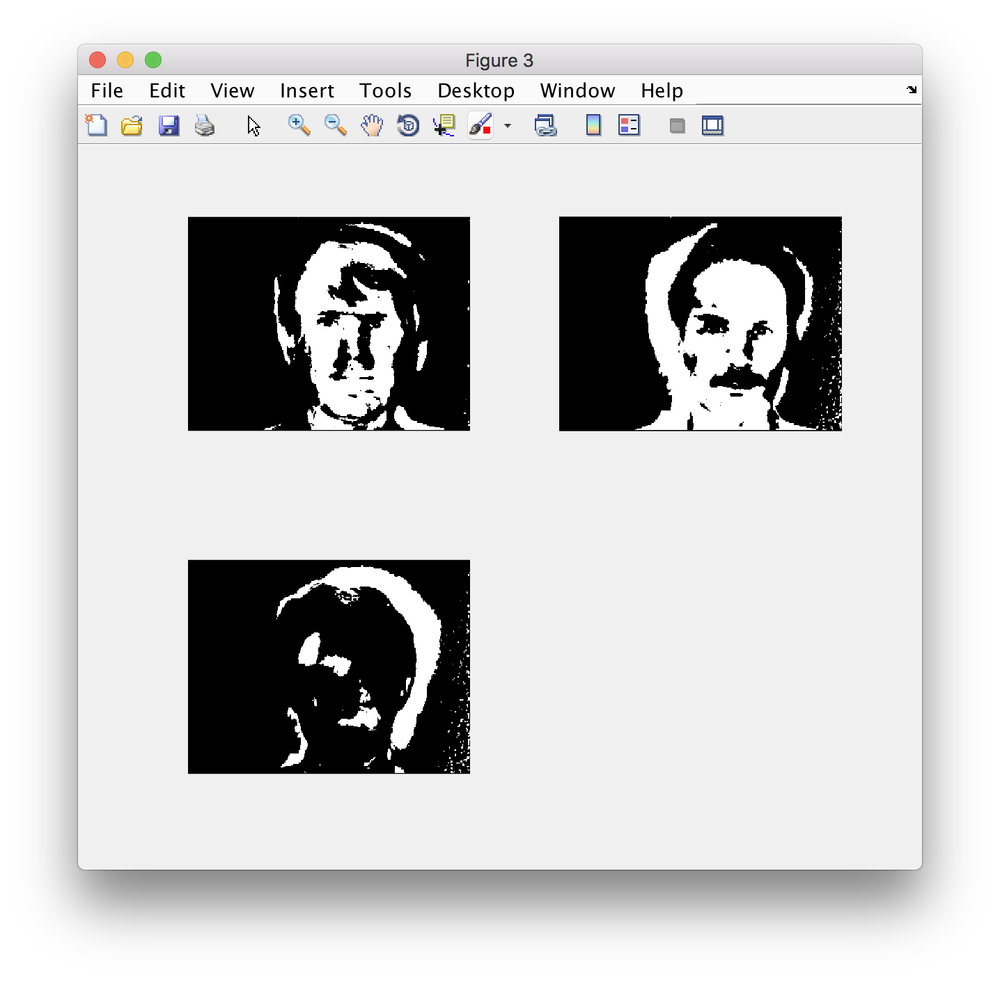

EigenFaces
===
Principal Component Analysis is statistical approach towards reducing the characteristic variables of a face for recognition.
We determine the covariance matrix and find the dominant eigen vectors. We perform recognition by the projection of a sample image to the eigenfaces and finding the minimum.
This is a very basic implementation meant for learning the basics of PCA with only single images as training set. 

The database consists of these images.


The mean is found and subtracted from the image to give the final result. 


We test it on the following image. 


This gives us
```2.pgm``` 

All images are taken from the Yale dataset, namely yalefaces.
